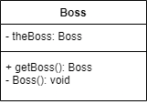
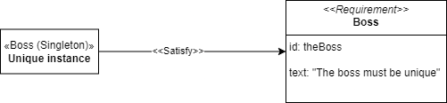
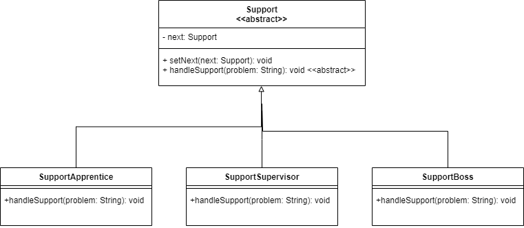

### Singleton Diagram

TheBoss is an example of the singleton design pattern. Only one instance of TheBoss can exist despite we creating more instances of it.

### Requeriment diagrama (Singleton)

The singleton example TheBoss satisfies the requirement "The Boss must be unique"

### Chain of Responsability

